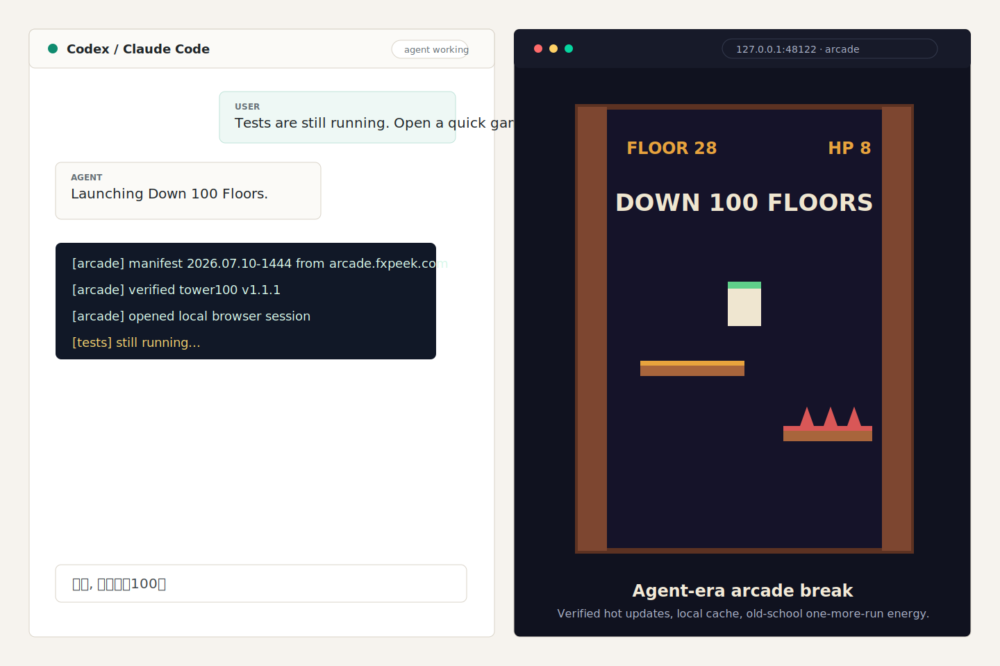
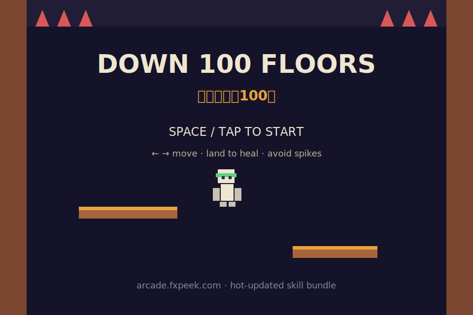
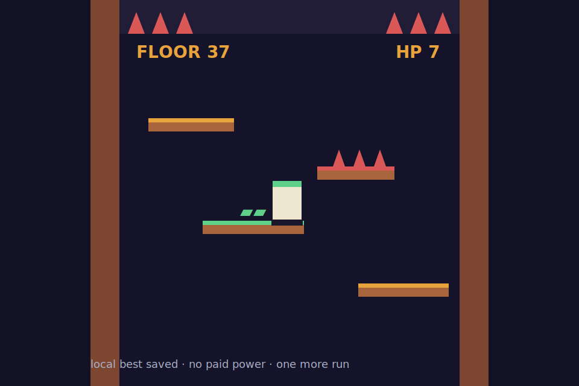

# Arcade Skill

An old-school browser arcade break for the age of coding agents.

When Claude Code, Codex, or another agent is compiling, installing, testing, or
thinking very hard, Arcade Skill opens a tiny nostalgic game in your browser:
fast to launch, easy to lose, annoyingly tempting to replay.



## Project Intro

Choose a language:

[中文](docs/intro.zh.md) · [English](docs/intro.en.md) · [Français](docs/intro.fr.md) · [Italiano](docs/intro.it.md) · [العربية](docs/intro.ar.md)

More launch copy, screenshots, positioning notes, and gallery assets live in
[docs/project-intro.md](docs/project-intro.md).

## Screenshots

| Game menu | In game |
| --- | --- |
|  |  |

## What It Does

- Opens **Down 100 Floors** from a Claude/Codex skill command.
- Feels like a tiny Flash-era / feature-phone arcade game, but ships as a
  verified single-file HTML bundle.
- Keeps the installed skill thin: Python launcher, manifest fetch, sha256 check,
  local cache, browser open.
- Ships new games, sponsor links, ads switches, notices, and kill switches
  through `https://arcade.fxpeek.com/manifest.json`.
- Works offline through a seed bundle and cached verified bundles.
- Uses original game code and art. No copied third-party source or assets.

## Support / GTM

Arcade Skill monetizes like a developer toy, not a pay-to-win mobile game.

- Tips: GitHub Sponsors stays visible in the repo and appears in-game only on a
  new personal best.
- Stripe Pro: reserved for later cosmetic perks, early access, or supporter
  badges. No paid health, paid revives, or leaderboard advantage.
- Web ads: AdSense can run on the web surface later; localhost skill sessions
  stay ad-free unless the manifest explicitly says otherwise.

## Install

Install the packaged `arcade.skill` from Releases, or copy the `skill/` folder
into your local skills directory. Then ask your coding agent:

> I'm waiting on tests. Open a quick game.

## Play Standalone

```bash
python3 skill/scripts/launcher.py            # zh UI
python3 skill/scripts/launcher.py --lang en  # en UI
```

Controls: arrow keys, A/D, or tap the left/right half of the screen. The loop is
deliberately retro: fall, panic, miss a platform, say “one more run.”

## Repo Layout

```text
skill/            distributable skill: SKILL.md, launcher, seed bundle
games/tower100/   game source: single self-contained HTML file
scripts/          build_manifest.py: hash bundles and write dist/manifest.json
dist/             GitHub Pages output
docs/             screenshots, language intros, launch copy
.github/          CI: push to main -> build -> deploy Pages
```

## Release Flow

1. Edit `games/tower100/tower100.html`.
2. Bump the version in `scripts/build_manifest.py`.
3. Push to `main`.
4. GitHub Actions rebuilds `dist/` and deploys Pages.
5. Installed users receive the new bundle on next launch.

## Roadmap

- [x] M1: Down 100 Floors + hot-update loader
- [x] M1.1: sharing, sponsor link, multilingual project intro
- [ ] M2: hub screen, second game, WeChat mini-game adapter
- [ ] M3: AdSense switch, Stripe Pro license flow, global leaderboard

## License

MIT.
